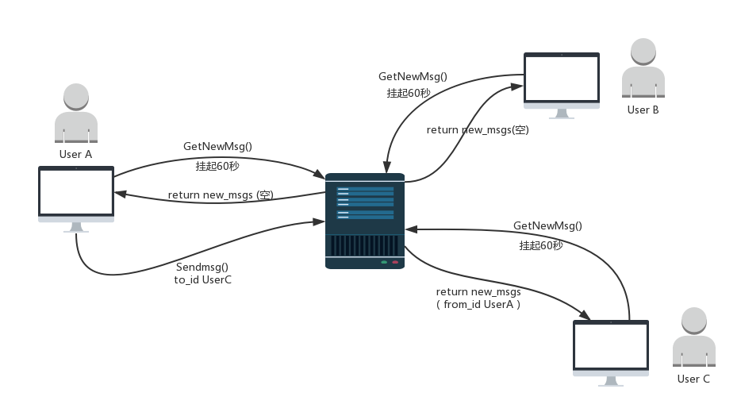

## WebQQ项目实现记录

使用Django1.9.5，是在运维管理平台中内嵌的一个内容，实现内部人员的聊天室。

M：QQgroup表，包含用户名、创建者、成员等字段，与运维系统的user_profile表建立外键关联。

T：

```
chat.html继承模板homepage，前端方面定义了点击事件和回车键盘符的抓取，
通过SwitchChatBox函数切换聊天框，实现不同用户信息的切换处理，这里调用了SessionHandle函数来进行不同用户聊天信息的缓存（存在全局的字典中，也可以考虑把字典存储Json格式的文件，实现聊天信息的永久存储）；
通过AddSendmsgIntoBox函数把捕获的发送消息添加进会话框内；
通过SendMsg函数把捕获的发送消息以及附加信息以字典的形式POST到后台；
通过GetNewMsg函数递归以get方式向后端轮询用户的消息数据，并显示在前端；
```

V：

```
通过cmdb的总的路由系统，来将webqq相关的url分发到WebQQ项目下的二级路由，二级路由中返回了chat.html等前端页面。并且在其中定义了send_msg和get_msg两条url，分别用于后台接收前端POST的数据内容以及后台向前端以HttpResponse发送接收到的聊天数据。
```


本项目没有使用websocket的方式来实现web间的通信，而是用队列的方式来实现。为了达到类似于websocket的长连接效果，当用户登录后，我们把字典中的一个键初始化为一个消息队列，如果后台没有接收到消息，则把消息队列挂起，阻塞60秒，相当于建立起一个临时的60秒长连接，期间内如果有消息到来，则会立即把消息发送给指定的用户，实现无延迟的效果；如果60秒依旧没有消息到来，则返回一个空列表，前端通过GetNewMsg函数的递归，再次向后台发起请求，申请一个60秒的连接挂起，如此反复。

实现流程图如下： 